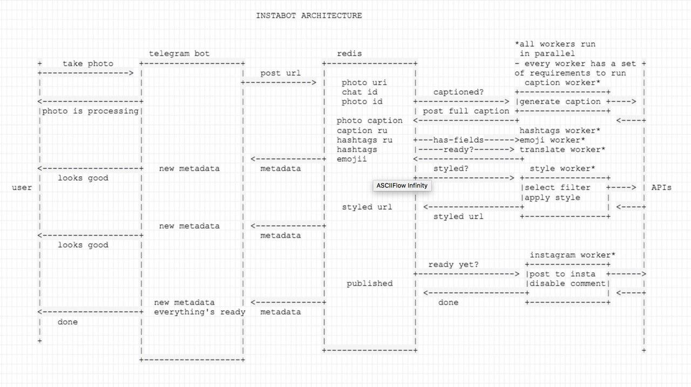

# InstaBot
## Project goal
The aim of this project is to build a telegram bot, that accepts an image as a file or photo and uploads it to
Instagram. It also adds appropriate hashtags and geotags based on image data. Video and gallery support could be added
at later stages of the project.

## Architecture
The project architecture looks like this:



Basically, each worker lives in a separate subdirectory and has it's own README

## Running
Use `./build.sh` script to build statically linked linux binaries inside corresponding worker folders.

Then use `docker-compose up --build` command to get up and running locally. To deploy to production, use 
`docker-machine` [as described here](https://medium.com/@Empanado/simple-continuous-deployment-with-docker-compose-docker-machine-and-gitlab-ci-9047765322e1)

## Setup
Make sure you have appropriate `.env` file at the project root that looks like so _(for more info on key values consult 
respective worker folders):_
````bash
# alpha dev
TELEGRAM_BOT_TOKEN=<token>

# ‼️ Production
# Should be commented during development
#TELEGRAM_BOT_TOKEN=<token>
# ‼️ Should be _never_ commited

TELEGRAM_DEMO_INSTA_URL=https://instagram.com/<username>
WORKER_INSTAGRAM_USERNAME=<username>
WORKER_INSTAGRAM_PASSWORD=<password>


# ‼️ Production
# Should be commented during development
#TELEGRAM_DEMO_INSTA_URL=https://instagram.com/<username>
#WORKER_INSTAGRAM_USERNAME=<username>
#WORKER_INSTAGRAM_PASSWORD=<password>
# ‼️ Should be _never_ commited

WORKER_CAPTION_KEY=<deepai.io api key>
````